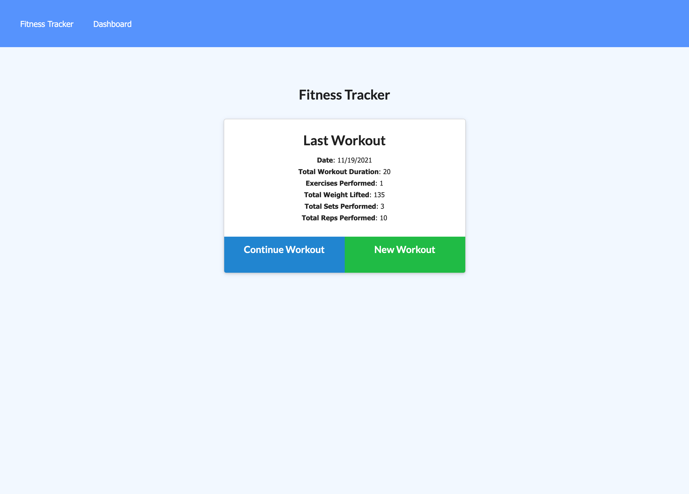
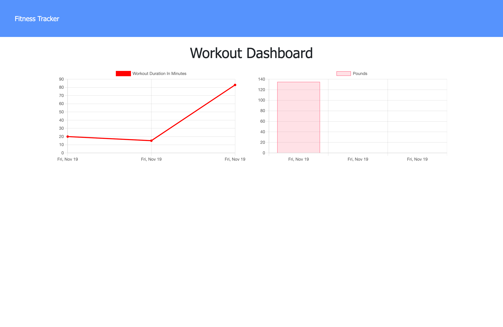

# Fitness_Tracker_mongoDB

## Description
I want to be able to view create and track daily workouts. I want to be able to log multiple exercises in a workout on a given day. I should also be able to track the name, type, weight, sets, reps, and duration of exercise. If the exercise is a cardio exercise, I should be able to track my distance traveled. This app gave good practice to using MongoDB and writing backend files to support the frontend.

## Table of Contents
- [Installation](#installation)
- [Usage](#usage)
- [Deployment](#deployment)
- [Credits](#credits)
- [License](#license)
- [Tests](#tests)
- [Qustions](#questions)

## Installation
node.js must be installed. Within node, express and mongoose must be installed.

## Usage
mongoDB must be running. You might need to change "localhost" to "127.0.0.1" or vice versa.

## Deployment
This app has been deployed on Heroku: https://fitnesstracker-rs.herokuapp.com/

## Credits
Collaborators that helped with this project: Various classmates help with writing routes

## License
This project is covered under an MIT license. More information can be found here: https://opensource.org/licenses/MIT

## Tests
N/A

## Questions
If you have any questions, feel free to email <mrronsit@gmail.com> or feel free to peruse my [Github](https://github.com/sitmeister)!
